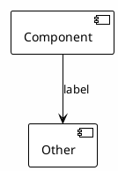

# Skill: Claude Kit Docs

Create or sync Technical Solution documentation with component-based structure, flat docs layout, and diagram rules.

## Decision Tree

1) Choose mode:
   - greenfield: create new component docs from template
   - sync: update existing docs to match code and decisions
2) Choose scope:
   - top-level system (always exists)
   - component/subsystem (create when a subsystem needs its own Technical Solution)
3) If a component README starts to carry too many diagrams or workflows, split into subcomponent docs.

## Non-negotiables

- Place header block `ml-system-docs` first in every component `README.md`.
- Set `Doc Type` to `Technical Solution`.
- Fill `Code reference` and `Last synced with code`.
- Set `Implemented in code`; if not implemented, set Status Draft.
- Use flat layout: `docs/<component>/README.md` + `docs/<component>/references/*.md` only.
- Ensure a top-level system component exists and links to subcomponents.
- Keep `README.md` high-level; move deep details and heavy diagrams to `references/`.
- Treat **Security and Compliance** as optional; include only when relevant.

## Componentization Rules

- Define components by responsibility and interface boundaries.
- Promote subsystems to components when they add diagrams or workflows.
- For each component, include name, functionality, doc link, and a host line (if known; keep host last).

## Document Structure (Component README)

1. **General Information** (terms, links, scope/boundaries, goals)
2. **Current State** (as-is architecture + key problems)
3. **Requirements** (functional, non-functional, constraints)
4. **Selected Solution** (to-be architecture diagram, rationale, trade-offs)
5. **Components** (overview + links to component docs)
6. **Processes and Workflows** (summaries; include a top-level workflow here when helpful, link detailed sequences in references)
7. **Interfaces and Configuration**
8. **Operations and Scaling**
9. **Observability**
10. **Security and Compliance** (optional)
11. **References** (links to `docs/<component>/references/*.md`)
12. **Appendices** (optional)

Use `docs/<component>/references/*.md` for detailed diagrams, API contracts, config matrices, or decision logs.

## Diagram Guidance

**Index diagrams:** 2-4 max, each 10-15 elements.

Required whenever applicable:
1. Current architecture (as-is)
2. Target architecture (to-be, C4 container)
3. Key flow (high-level)

Everything else goes to `references/`. If README exceeds 4 diagrams, split into component docs.

### Diagram Standard

Use PlantUML inline in markdown. Label all arrows.

**C4 (target architecture):**
- Use `!include <C4/C4_Container>` when the diagram is a container-level view.
- Keep labels short; add details in notes or in references.

## Sync Workflow

1) Inventory `docs/` and map existing docs to components.
2) Ensure a top-level component exists and links to subcomponents.
3) Align each component README with current code and decisions.
4) Move detailed diagrams and specs into `references/`.
5) Update header fields and code reference.

## Language

Default to English templates. Use the `.ru` templates when the user requests Russian.

## Templates

- `@.claude/skills/claude-kit-docs/templates/TechnicalSolution.full.template.md` — full Technical Solution (EN)
- `@.claude/skills/claude-kit-docs/templates/TechnicalSolution.full.ru.template.md` — full Technical Solution (RU)
- `@.claude/skills/claude-kit-docs/templates/Simple.template.md` — simple component doc (EN; may omit goals/requirements/observability)
- `@.claude/skills/claude-kit-docs/templates/Simple.ru.template.md` — simple component doc (RU; may omit goals/requirements/observability)
- `@.claude/skills/claude-kit-docs/templates/Research.template.md` — research note (EN)
- `@.claude/skills/claude-kit-docs/templates/Research.ru.template.md` — research note (RU)
- `@.claude/skills/claude-kit-docs/templates/DocsStructure.template.md` — docs folder layout

## Code Reference Helpers

- Branch: `git rev-parse --abbrev-ref HEAD`
- Commit: `git rev-parse --short HEAD`
- If unavailable: set `Code reference` to `UNKNOWN` and note it in the doc.
