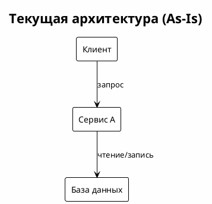
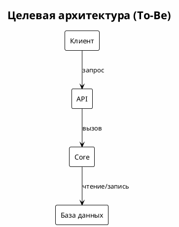
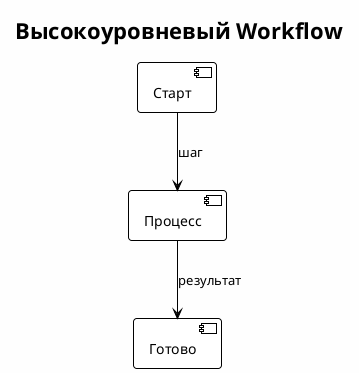

# Техническое решение: <Название компонента>

<!-- ml-system-docs -->
| Field | Value |
|-------|-------|
| **Doc Type** | Technical Solution |
| **Scope** | <система/компонент> |
| **Status** | Draft / Active / Deprecated |
| **Owner** | <ответственный/команда> |
| **Last synced with code** | <YYYY-MM-DD> |
| **Code reference** | <branch>@<short-sha> |
| **Implemented in code** | Yes / Partial / No |
| **Related docs** | [references/](references/), <ссылки на компоненты> |

---

## Оглавление

1. [Общая информация](#1-общая-информация)
2. [Текущее состояние](#2-текущее-состояние)
3. [Целевое решение](#3-целевое-решение)
4. [Компоненты](#4-компоненты)
5. [Процессы и Workflow](#5-процессы-и-workflow)
6. [Интерфейсы и конфигурация (опционально)](#6-интерфейсы-и-конфигурация-опционально)
7. [Ссылки](#7-ссылки)
8. [Приложения](#8-приложения)

---

## 1. Общая информация

**Контекст:** <зачем нужен компонент>

**Границы:** <что включено/исключено>

---

## 2. Текущее состояние

- Ключевые проблемы: <проблема>

---

## 3. Целевое решение

- Обоснование: <решение>
- Компромиссы: <компромисс>

---

## 4. Компоненты

**Компонент: <название>**
- Функциональность: <что делает>
- Док: [docs/<component>/README.md](../<component>/README.md)
- Host: <runtime/cluster/namespace> (если известно)

---

## 5. Процессы и Workflow

При необходимости добавьте верхнеуровневый workflow здесь и дайте ссылки на детали в `references/`.

- <workflow> — [references/workflows.md](references/workflows.md)

---

## 6. Интерфейсы и конфигурация (опционально)

- **Интерфейсы:** <API, события, контракты>
- **Конфигурация:** <файлы, флаги, источники>

---

## 7. Ссылки

- [references/diagrams.md](references/diagrams.md)
- [references/workflows.md](references/workflows.md)
- [references/interfaces.md](references/interfaces.md)
- [references/configs.md](references/configs.md)
- [references/decisions.md](references/decisions.md)

---

## 8. Приложения

- <приложение>
