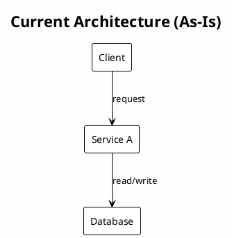
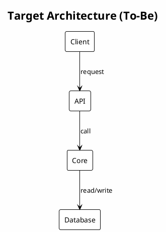
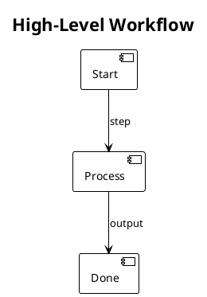

# Technical Solution: <Component Name>

<!-- ml-system-docs -->
| Field | Value |
|-------|-------|
| **Doc Type** | Technical Solution |
| **Scope** | <system/component> |
| **Status** | Draft / Active / Deprecated |
| **Owner** | <name/team> |
| **Last synced with code** | <YYYY-MM-DD> |
| **Code reference** | <branch>@<short-sha> |
| **Implemented in code** | Yes / Partial / No |
| **Related docs** | [references/](references/), <links to components> |

---

## Table of Contents

1. [General Information](#1-general-information)
2. [Current State](#2-current-state)
3. [Target Solution](#3-target-solution)
4. [Components](#4-components)
5. [Processes and Workflows](#5-processes-and-workflows)
6. [Interfaces and Configuration (Optional)](#6-interfaces-and-configuration-optional)
7. [References](#7-references)
8. [Appendices](#8-appendices)

---

## 1. General Information

**Context:** <why this component exists>

**Scope:** <what is in/out>

---

## 2. Current State

- Key problems: <problem>

---

## 3. Target Solution

- Rationale: <decision>
- Trade-offs: <trade-off>

---

## 4. Components

**Component: <name>**
- Functionality: <what it does>
- Doc: [docs/<component>/README.md](../<component>/README.md)
- Host: <runtime/cluster/namespace> (if known)

---

## 5. Processes and Workflows

Add a high-level workflow here when helpful and link to details in `references/`.

- <workflow> — [references/workflows.md](references/workflows.md)

---

## 6. Interfaces and Configuration (Optional)

- **Interfaces:** <APIs, events, contracts>
- **Configuration:** <config files, flags, sources>

---

## 7. References

- [references/diagrams.md](references/diagrams.md)
- [references/workflows.md](references/workflows.md)
- [references/interfaces.md](references/interfaces.md)
- [references/configs.md](references/configs.md)
- [references/decisions.md](references/decisions.md)

---

## 8. Appendices

- <appendix>
