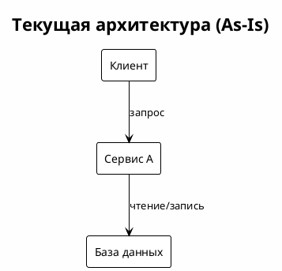
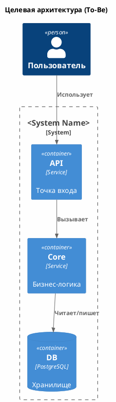
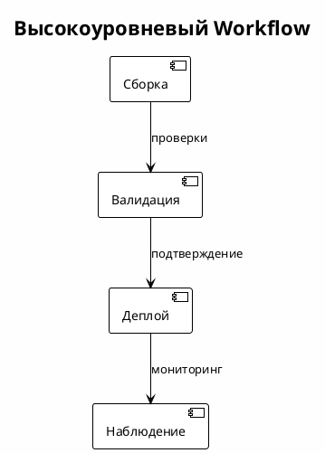

# Техническое решение: <Название компонента>

<!-- ml-system-docs -->
| Field | Value |
|-------|-------|
| **Doc Type** | Technical Solution |
| **Scope** | <система/компонент> |
| **Status** | Draft / Active / Deprecated |
| **Owner** | <ответственный/команда> |
| **Last synced with code** | <YYYY-MM-DD> |
| **Code reference** | <branch>@<short-sha> |
| **Implemented in code** | Yes / Partial / No |
| **Related docs** | [references/](references/), <ссылки на компоненты> |

---

## Оглавление

1. [Общая информация](#1-общая-информация)
   - [1.1. Термины и сокращения](#11-термины-и-сокращения)
   - [1.2. Полезные ссылки](#12-полезные-ссылки)
   - [1.3. Границы и содержание](#13-границы-и-содержание)
   - [1.4. Цели](#14-цели)
2. [Текущее состояние](#2-текущее-состояние)
   - [2.1. Текущая архитектура (As-Is)](#21-текущая-архитектура-as-is)
   - [2.2. Ключевые проблемы](#22-ключевые-проблемы)
3. [Требования](#3-требования)
   - [3.1. Функциональные требования](#31-функциональные-требования)
   - [3.2. Нефункциональные требования](#32-нефункциональные-требования)
   - [3.3. Ограничения](#33-ограничения)
4. [Выбранное решение](#4-выбранное-решение)
   - [4.1. Архитектурное решение (To-Be)](#41-архитектурное-решение-to-be)
   - [4.2. Обоснование](#42-обоснование)
   - [4.3. Компромиссы](#43-компромиссы)
5. [Компоненты](#5-компоненты)
6. [Процессы и Workflow](#6-процессы-и-workflow)
7. [Интерфейсы и конфигурация](#7-интерфейсы-и-конфигурация)
8. [Эксплуатация и масштабирование](#8-эксплуатация-и-масштабирование)
9. [Наблюдаемость](#9-наблюдаемость)
10. [Безопасность и соответствие (опционально)](#10-безопасность-и-соответствие-опционально)
11. [Ссылки](#11-ссылки)
12. [Приложения](#12-приложения)

---

## 1. Общая информация

### 1.1. Термины и сокращения

| Термин | Значение | Примечания |
| --- | --- | --- |
| <термин> | <значение> | <примечания> |

### 1.2. Полезные ссылки

- <название> — <url>

### 1.3. Границы и содержание

**Включает:**
- <пункт>

**Не включает:**
- <пункт>

### 1.4. Цели

- <цель>

---

## 2. Текущее состояние

### 2.1. Текущая архитектура (As-Is)

### 2.2. Ключевые проблемы

- <проблема>

---

## 3. Требования

### 3.1. Функциональные требования

- <требование>

### 3.2. Нефункциональные требования

| Метрика | Цель | Примечания |
| --- | --- | --- |
| <метрика> | <цель> | <примечания> |

### 3.3. Ограничения

- <ограничение>

---

## 4. Выбранное решение

### 4.1. Архитектурное решение (To-Be)

### 4.2. Обоснование

- <обоснование>

### 4.3. Компромиссы

- <компромисс>

---

## 5. Компоненты

Опишите компоненты и дайте ссылки на их технические решения.

**Компонент: <название>**
- Функциональность: <что делает>
- Док: [docs/<component>/README.md](../<component>/README.md)
- Host: <runtime/cluster/namespace> (если известно)

**Компонент: <название>**
- Функциональность: <что делает>
- Док: [docs/<component>/README.md](../<component>/README.md)
- Host: <runtime/cluster/namespace> (если известно)

---

## 6. Процессы и Workflow

Суммарно опишите ключевые процессы (деплой, обновления, откат). При необходимости добавьте верхнеуровневый workflow здесь и дайте ссылки на детали в `references/`.

- <workflow> — [references/workflows.md](references/workflows.md)

---

## 7. Интерфейсы и конфигурация

- **Интерфейсы:** <API, события, контракты>
- **Конфигурация:** <файлы, флаги, источники>

---

## 8. Эксплуатация и масштабирование

- <заметки>

---

## 9. Наблюдаемость

- **Метрики:** <метрики>
- **Логи/Трейсинг:** <заметки>

---

## 10. Безопасность и соответствие (опционально)

- <аутентификация/авторизация>
- <обработка данных>

---

## 11. Ссылки

- [references/diagrams.md](references/diagrams.md)
- [references/interfaces.md](references/interfaces.md)
- [references/workflows.md](references/workflows.md)
- [references/configs.md](references/configs.md)
- [references/decisions.md](references/decisions.md)

---

## 12. Приложения

- <приложение>
