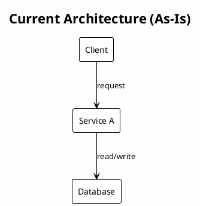
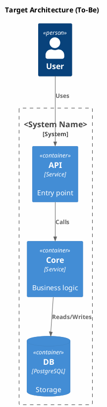
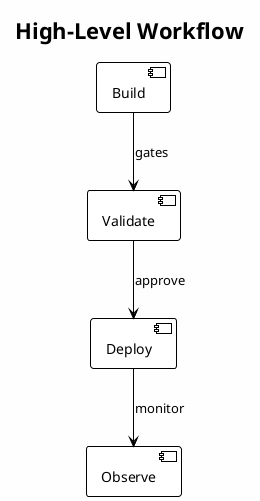

# Technical Solution: <Component Name>

<!-- ml-system-docs -->
| Field | Value |
|-------|-------|
| **Doc Type** | Technical Solution |
| **Scope** | <system/component> |
| **Status** | Draft / Active / Deprecated |
| **Owner** | <name/team> |
| **Last synced with code** | <YYYY-MM-DD> |
| **Code reference** | <branch>@<short-sha> |
| **Implemented in code** | Yes / Partial / No |
| **Related docs** | [references/](references/), <links to components> |

---

## Table of Contents

1. [General Information](#1-general-information)
   - [1.1. Terms and Abbreviations](#11-terms-and-abbreviations)
   - [1.2. Useful Links](#12-useful-links)
   - [1.3. Scope and Boundaries](#13-scope-and-boundaries)
   - [1.4. Goals](#14-goals)
2. [Current State](#2-current-state)
   - [2.1. Current Architecture (As-Is)](#21-current-architecture-as-is)
   - [2.2. Key Problems](#22-key-problems)
3. [Requirements](#3-requirements)
   - [3.1. Functional Requirements](#31-functional-requirements)
   - [3.2. Non-Functional Requirements](#32-non-functional-requirements)
   - [3.3. Constraints](#33-constraints)
4. [Selected Solution](#4-selected-solution)
   - [4.1. Architecture Decision (To-Be)](#41-architecture-decision-to-be)
   - [4.2. Rationale](#42-rationale)
   - [4.3. Trade-offs](#43-trade-offs)
5. [Components](#5-components)
6. [Processes and Workflows](#6-processes-and-workflows)
7. [Interfaces and Configuration](#7-interfaces-and-configuration)
8. [Operations and Scaling](#8-operations-and-scaling)
9. [Observability](#9-observability)
10. [Security and Compliance (Optional)](#10-security-and-compliance-optional)
11. [References](#11-references)
12. [Appendices](#12-appendices)

---

## 1. General Information

### 1.1. Terms and Abbreviations

| Term | Meaning | Notes |
| --- | --- | --- |
| <term> | <meaning> | <notes> |

### 1.2. Useful Links

- <link-name> — <url>

### 1.3. Scope and Boundaries

**In scope:**
- <item>

**Out of scope:**
- <item>

### 1.4. Goals

- <goal>

---

## 2. Current State

### 2.1. Current Architecture (As-Is)

### 2.2. Key Problems

- <problem>

---

## 3. Requirements

### 3.1. Functional Requirements

- <requirement>

### 3.2. Non-Functional Requirements

| Metric | Target | Notes |
| --- | --- | --- |
| <metric> | <target> | <notes> |

### 3.3. Constraints

- <constraint>

---

## 4. Selected Solution

### 4.1. Architecture Decision (To-Be)

### 4.2. Rationale

- <decision>

### 4.3. Trade-offs

- <trade-off>

---

## 5. Components

List component responsibilities and link to their Technical Solutions.

**Component: <name>**
- Functionality: <what it does>
- Doc: [docs/<component>/README.md](../<component>/README.md)
- Host: <runtime/cluster/namespace> (if known)

**Component: <name>**
- Functionality: <what it does>
- Doc: [docs/<component>/README.md](../<component>/README.md)
- Host: <runtime/cluster/namespace> (if known)

---

## 6. Processes and Workflows

Summarize key flows (deployment, updates, rollback). Include a top-level workflow here when it helps, and link detailed sequences in `references/`.

- <workflow> — [references/workflows.md](references/workflows.md)

---

## 7. Interfaces and Configuration

- **Interfaces:** <APIs, events, contracts>
- **Configuration:** <config files, flags, sources>

---

## 8. Operations and Scaling

- <operations notes>

---

## 9. Observability

- **Metrics:** <metrics>
- **Logs/Tracing:** <notes>

---

## 10. Security and Compliance (Optional)

- <authn/authz>
- <data handling>

---

## 11. References

- [references/diagrams.md](references/diagrams.md)
- [references/interfaces.md](references/interfaces.md)
- [references/workflows.md](references/workflows.md)
- [references/configs.md](references/configs.md)
- [references/decisions.md](references/decisions.md)

---

## 12. Appendices

- <appendix>
