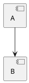
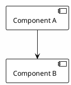

# Skill: Documentation

## Activation

When used, announce:
> **Documentation**: applying project documentation standards

---

## Purpose

- Maintain accurate, structured documentation synchronized with codebase
- Integrate PlantUML diagrams for visual architecture representation
- Track component status in STATUS.md
- Prevent documentation drift

## When to Use

- Creating new documentation (SYSTEM-DESIGN, README, guides)
- Updating STATUS.md after implementation changes
- Adding architecture diagrams (PlantUML)
- Auditing existing docs for accuracy
- Generating documentation for new features/APIs

---

## Documentation Structure

### Top-Level Files

```
docs/
├── SYSTEM-DESIGN.md    # Central technical solution (goals + diagrams)
├── STATUS.md           # Component implementation status
├── README.md           # Documentation index
├── architecture/       # Architecture docs + C4 diagrams
├── diagrams/           # PlantUML source files
├── pipeline/           # Pipeline stage docs
├── guides/             # How-to guides
└── reference/          # CLI, API, providers reference
```

### Key Documents

| Document | Purpose | Update Frequency |
|----------|---------|------------------|
| **SYSTEM-DESIGN.md** | Goals, architecture, embedded diagrams | On architecture changes |
| **STATUS.md** | Component status table | After each feature/fix |
| **architecture/overview.md** | Package structure, concepts | On structure changes |
| **reference/cli.md** | CLI commands reference | On CLI changes |

---

## PlantUML Integration

### Context-Aware Diagrams

**Different contexts require different formats:**

| Context | Format | Why |
|---------|--------|-----|
| Writing to `.md` files | PlantUML inline | Renders in VS Code, GitHub |
| CLI responses to user | ASCII art or text | PlantUML won't render in terminal |

**In markdown files** — use PlantUML:


**In CLI responses** — use ASCII:
```
docs_dir/ --> ContentSource --> Chunker --> Index
                  |
            RawDocument(text, path)
```

**Anti-pattern:** Never output raw `@startuml` blocks to terminal — they won't render and clutter the output.

### Embedding Diagrams (in files)

**ALWAYS embed PlantUML inline in markdown files.** Never create separate `.puml` files.

**Why inline:**
- Renders automatically in VS Code, GitHub, GitLab
- Single source of truth (diagram + context together)
- No orphaned diagram files
- Easier to maintain

**Format:**
```markdown
## Architecture


```

**Anti-pattern (DON'T):**
```
docs/diagrams/my-diagram.puml  # Separate file - BAD
```

**Correct (DO):**
```markdown
# My Feature

Description...

```plantuml
@startuml my-feature
... diagram content inline ...
@enduml
```
```

### Diagram Conventions

1. **Theme**: Always use `!theme plain` for consistency
2. **Background**: `skinparam backgroundColor #FEFEFE`
3. **Font**: `skinparam defaultFontName Consolas`
4. **Naming**: `@startuml diagram-name` (kebab-case)

### Diagram Types by Purpose

| Purpose | Diagram Type | Embed In |
|---------|-------------|----------|
| System context | C4 Context | docs/architecture/*.md |
| Component structure | C4 Container | docs/architecture/*.md |
| Request flow | Sequence | relevant guide or design doc |
| Data types | Class | docs/reference/*.md |
| Pipeline stages | Activity/Flowchart | docs/pipeline/*.md |
| I/O boundaries | Package | .claude/DESIGN.md |
| Research comparison | Component/Class | docs/research/*/*.md |

---

## STATUS.md Format

### Status Legend

```markdown
| Status | Meaning |
|--------|---------|
| **Implemented** | Production-ready, tested |
| **In Progress** | Under active development |
| **Planned** | Designed but not started |
| **Experimental** | Working but not stable |
```

### Component Table Format

```markdown
## Core Pipeline

| Component | Status | Notes |
|-----------|--------|-------|
| **Ingestion** | | |
| MarkdownSource | Implemented | Primary source type |
| MarkdownChunker | Implemented | RecursiveCharacter with heading extraction |
| PDF support | Planned | Via pypdf |
```

### Update Rules

1. Update immediately after completing a feature
2. Mark "In Progress" when starting work
3. Add notes for non-obvious status
4. Group by functional area (Pipeline, Providers, Services, etc.)

---

## Writing Style

### Principles

1. **Brevity**: One thought per paragraph, no walls of text
2. **Verification First**: Read code before writing docs
3. **Single Source**: Link, don't duplicate

### Document Structure

**Short doc (README, overview):**
```markdown
# Title

One-two sentences: what and why.

## Key Points

Minimal info for understanding.

## Example (if needed)

```python
# 3-5 lines of code
```
```

**Full doc (guides, reference):**
```markdown
# Title

Brief description.

## Quick Start

Minimal working example.

## Usage

Main scenarios. No filler.

## Configuration

Only if there are configurable parameters.
```

### Anti-patterns

- "In this document we will..." - get to the point
- Repeating obvious info from title
- Empty sections "TBD", "Coming soon"
- Sections "Introduction", "Overview", "Background"

---

## Documentation Workflow

### Creating New Documentation

1. **Analyze** - understand what needs documenting
2. **Structure** - choose appropriate template
3. **Draft** - write minimal content
4. **Diagram** - add PlantUML if architecture is involved
5. **Trim** - remove filler, cut in half
6. **Validate** - check examples work, links valid
7. **Update STATUS.md** - reflect new component status

### Updating Existing Documentation

1. **Locate** - find all affected docs
2. **Verify** - read current code
3. **Update** - modify content to match
4. **Sync STATUS.md** - update component status
5. **Cross-reference** - update related docs if needed

### Documentation Audit

1. Find all `.md` in docs/ and README.md files
2. Compare with code - what's outdated?
3. Prioritize: critical (wrong info) > medium (incomplete) > low (style)
4. Fix or delete

---

## Checklist

### Quality
- [ ] Code read before writing
- [ ] Can understand in 30 seconds
- [ ] No filler or repetition
- [ ] Examples work

### Structure
- [ ] Follows project structure conventions
- [ ] Links are valid
- [ ] STATUS.md updated

### Diagrams
- [ ] PlantUML embedded inline (not just linked)
- [ ] Uses project theme conventions
- [ ] Named appropriately

---

## Research Documentation

Research documents have their own structure and process.

**Structure:** See `.claude/rules/research-structure.md`
**Process:** See `.claude/skills/research/SKILL.md`
**Templates:** See `.claude/skills/research/templates/`

Key principle: Published findings go to `docs/research/<topic>/`. Working drafts stay in epic `artifacts/`.

---

## Related Files

- `docs/SYSTEM-DESIGN.md` - main technical solution
- `docs/STATUS.md` - component status
- `docs/research/README.md` - research index
- `docs/diagrams/README.md` - diagram rendering guide
- `.claude/agents/doc-writer.md` - doc-writer agent
- `.claude/skills/research/SKILL.md` - research skill
- `.claude/rules/research-structure.md` - research documentation structure

## Definition of Done

- Documentation matches code
- STATUS.md reflects current state
- Diagrams embedded and rendering
- No broken links
- Research properly indexed (if applicable)
